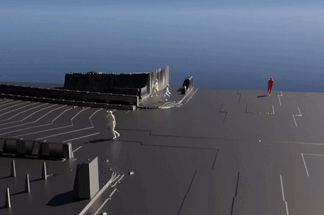

# PACER+: On-Demand Pedestrian Animation Controller in Driving Scenarios
Official implementation of the paper "PACER+: On-Demand Pedestrian Animation Controller in Driving Scenarios" (CVPR 2024). 
    
We address the challenge of content diversity and controllability in pedestrian simulation for driving scenarios. The fundamental contribution of our framework lies in combining the motion tracking task with trajectory following, which enables the tracking of specific motion parts (eg., upper body) while simultaneously following the given trajectory by a single policy. This way, we enhance both the diversity of simulated human motion within the given scenario and the controllability of the content, including language-based control. Our framework facilitates the generation of a wide range of human motions, contributing to greater realism and adaptability in pedestrian simulations for driving scenarios.

<div float="center">
  
</div>


# Table of Contents
* [News 🚩](#news-)
* [TODOs](#todos)
* [Installation](#installation)
* [Training](#training)

# News 🚩
[March 8, 2024] Training code released. This project is still under development.


# Todos

- []  Release dataset tools for different humanoid agents.
- []  Release the inference environment and our web interface.
- []  Release my checkpoints.
- []  Release the training code for CNN model.
- [x] Release an example city environment.
- [x] Release the training code for basic model.

# Installation
To create the environment, follow the following instructions: 

1. Create new conda environment and install pytroch:


```
conda create -n isaac python=3.8
conda install pytorch torchvision torchaudio pytorch-cuda=11.6 -c pytorch -c nvidia
pip install -r requirement.txt
```

2. Download and setup [Isaac Gym](https://developer.nvidia.com/isaac-gym). 

3. Follow [PHC](https://github.com/ZhengyiLuo/PHC/tree/master) to download the SMPL parameters. Put them in the `data/smpl` folder, unzip them into 'data/smpl' folder. Please download the v1.1.0 version, which contains the neutral humanoid. Rename the files `basicmodel_neutral_lbs_10_207_0_v1.1.0`, `basicmodel_m_lbs_10_207_0_v1.1.0.pkl`, `basicmodel_f_lbs_10_207_0_v1.1.0.pkl` to `SMPL_NEUTRAL.pkl`, `SMPL_MALE.pkl` and `SMPL_FEMALE.pkl`. Rename The file structure should look like this:

```

|-- data
    |-- smpl
        |-- SMPL_FEMALE.pkl
        |-- SMPL_NEUTRAL.pkl
        |-- SMPL_MALE.pkl

```
4. Prepare data for training. You can follow [PHC](https://github.com/ZhengyiLuo/PHC/tree/master) to obtain the full AMASS dataset for imitation task and [PACER](https://github.com/nv-tlabs/pacer) to obtain the selected motions for AMP. The file structure should look like this:

```
| -- data
    | -- amass
        | -- pkls
            | -- amass_isaac_gender_betas_unique.pkl
            | -- amass_isaac_run_upright_slim.pkl
            | -- amass_isaac_im_train_take6_upright_slim.pkl

```
5. City Environment: We have an example environment for the virtual city environment. This environment is built on top of the [Matrix City](https://city-super.github.io/matrixcity/). You can download the environment from [here](https://drive.google.com/file/d/1koj-EqLrnivLVwmuRFydWZQgUGavmWYS/view?usp=drive_link).

# Training
We train our policy on a single A100 GPU. We do not use Residual Force Control (RFC) and Residual PD for this work. We test our code on A100, RTX 3090 and RTX 4090. The training time is almost 3 days for our experiments.

    export OMP_NUM_THREADS=1
    python -u  amp/run.py --task HumanoidPedestrianTerrainIm --cfg_env amp/data/cfg/release/mlp_slim_exp_v1.yaml --network_path output/mlp_slim_exp_v1 --headless --num_envs 4096 --num_threads 4


# Citation
If you find this work useful for your research, please cite our paper:
```
@inproceedings{Wang2024PacerPlus,
    author={Jingbo Wang and Zhengyi Luo and Yixuan Li and Ye Yuan and Bo Dai},
    title={PACER+: On-Demand Pedestrian Animation Controller in Driving Scenarios},
    booktitle={Conference on Computer Vision and Pattern Recognition (CVPR)},
    year={2024}
}        
```

Also consider citing these prior works that are used in this project:

```
@inproceedings{Luo2023PerpetualHC,
    author={Zhengyi Luo and Jinkun Cao and Alexander W. Winkler and Kris Kitani and Weipeng Xu},
    title={Perpetual Humanoid Control for Real-time Simulated Avatars},
    booktitle={International Conference on Computer Vision (ICCV)},
    year={2023}
}  
@inproceedings{rempeluo2023tracepace,
    author={Rempe, Davis and Luo, Zhengyi and Peng, Xue Bin and Yuan, Ye and Kitani, Kris and Kreis, Karsten and Fidler, Sanja and Litany, Or},
    title={Trace and Pace: Controllable Pedestrian Animation via Guided Trajectory Diffusion},
    booktitle={Conference on Computer Vision and Pattern Recognition (CVPR)},
    year={2023}
}

@inproceedings{wang2023learning,
  title={Learning human dynamics in autonomous driving scenarios},
  author={Wang, Jingbo and Yuan, Ye and Luo, Zhengyi and Xie, Kevin and Lin, Dahua and Iqbal, Umar and Fidler, Sanja and Khamis, Sameh},
  booktitle={International Conference on Computer Vision (ICCV)},
  year={2023}
}     
@inproceedings{Luo2022EmbodiedSH,
  title={Embodied Scene-aware Human Pose Estimation},
  author={Zhengyi Luo and Shun Iwase and Ye Yuan and Kris Kitani},
  booktitle={Advances in Neural Information Processing Systems},
  year={2022}
}
@inproceedings{Luo2021DynamicsRegulatedKP,
  title={Dynamics-Regulated Kinematic Policy for Egocentric Pose Estimation},
  author={Zhengyi Luo and Ryo Hachiuma and Ye Yuan and Kris Kitani},
  booktitle={Advances in Neural Information Processing Systems},
  year={2021}
}
```

# References
This repository is built on top of the following amazing repositories:
* Main code framework is from: [IsaacGymEnvs](https://github.com/NVIDIA-Omniverse/IsaacGymEnvs)
* Part of the SMPL_robot code is from: [UHC](https://github.com/ZhengyiLuo/UniversalHumanoidControl)
* SMPL models and layer is from: [SMPL-X model](https://github.com/vchoutas/smplx)
* Codes for imitation learning is from: [PHC](https://github.com/ZhengyiLuo/PHC/tree/master)
* Codes for pedestrian simulation is from: [PACER](https://github.com/nv-tlabs/pacer)
* Codes for motion tracking on Waymo Open Dataset: [LDA](https://openaccess.thecvf.com/content/ICCV2023/papers/Wang_Learning_Human_Dynamics_in_Autonomous_Driving_Scenarios_ICCV_2023_paper.pdf)
* Dataset tools for virtual city environment: [Matrix City](https://city-super.github.io/matrixcity/)

Please follow the lisence of the above repositories for usage.